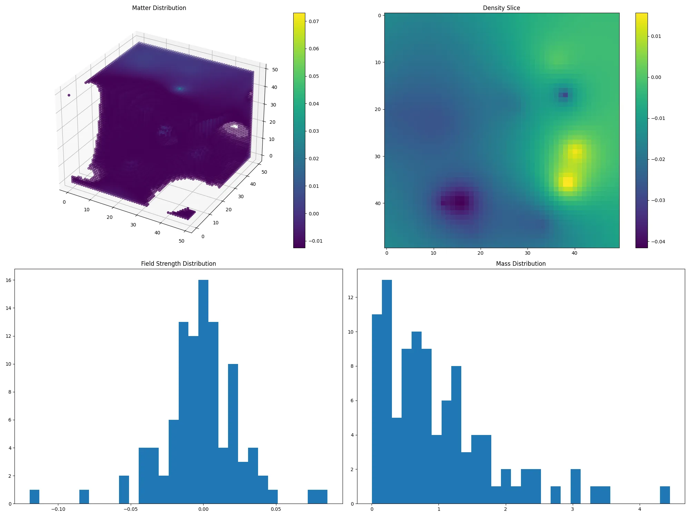

# Tensor Universe Simulation

A Python-based simulation modeling a universe composed of interacting tensor singularities. Visualizes matter distribution, density slices, and distributions of field strengths and masses using Gradio for an interactive interface.

## Features

- **Gravitational Interactions:** Simulates forces between tensor singularities based on Newtonian physics.
- **3D and 2D Visualizations:** Displays matter distribution in both three-dimensional space and two-dimensional slices.
- **Distribution Histograms:** Shows distributions of field strengths and masses among singularities.
- **Interactive Interface:** Customize simulation parameters through a user-friendly Gradio web interface.

## Installation

1. **Clone the Repository:**

   git clone https://github.com/anttiluode/TensorUniverse.git
   
   cd physical-tensor-universe
# Install Dependencies:

Ensure you have Python 3.7 or higher installed. Then, install the required Python libraries:

pip install numpy torch matplotlib scipy gradio vispy

# Usage

Run the simulation by executing the Python script:

python app.py

This will launch a Gradio web interface where you can:

Set Parameters:

Number of Singularities: Adjust the number of tensor singularities in the universe.

Universe Size: Define the spatial dimensions of the simulated universe.

Simulation Steps: Specify how many iterations the simulation will run.

# View Visualizations:

Matter Distribution: 3D scatter plot showing regions of high matter density.
Density Slice: 2D heatmap of a cross-sectional slice through the universe.
Field Strength Distribution: Histogram of tensor field strengths.
Mass Distribution: Histogram of singularity masses.

Example

# License

This project is licensed under the MIT License.

# Acknowledgements

Claude: For the code

Gradio: For the interactive web interface.

Matplotlib: For powerful visualization capabilities.

PyTorch: For tensor computations and simulations.

NumPy & SciPy: For numerical and scientific computing.
